# PyPI Download Analytics for compliance-trestle

**Real-time insights into compliance-trestle package adoption and usage patterns**

This repository contains BigQuery analytics tools and reports for the [compliance-trestle](https://github.com/oscal-compass/compliance-trestle) Python package, part of the OSCAL Compass project.

**Report Date:** May 15, 2026
*Updated weekly by CI/CD pipeline*

---

## 📊 Key Metrics Summary

| Metric | 30 Days | 90 Days |
|--------|---------|---------|
| **Total Downloads** | 84,522 | 178,490 |
| **Countries Reached** | 0 | 0 |
| **CI/CD Installs** | 69% | 63% |
| **UV Market Share** | 0.0% | 0.0% |
| **Confirmed MCP Usage** | 109 (0.13%) | 305 (0.17%) |

---

## 🌍 Geographic Distribution

### 30-Day Analysis

**Top 10 Countries:**

| Rank | Country | Downloads | % of Total |
|------|---------|-----------|------------|
| 1 | 🇺🇸 United States | 71,993 | 92.3% |
| 2 | 🇸🇬 Singapore | 2,408 | 3.1% |
| 3 | 🇨🇳 China | 830 | 1.1% |
| 4 | 🇷🇺 Russia | 402 | 0.5% |
| 5 | 🇯🇵 Japan | 347 | 0.4% |
| 6 | 🇬🇧 United Kingdom | 318 | 0.4% |
| 7 | 🇩🇪 Germany | 303 | 0.4% |
| 8 | 🇫🇷 France | 238 | 0.3% |
| 9 | 🇹🇼 Taiwan | 214 | 0.3% |
| 10 | 🇪🇸 Spain | 197 | 0.3% |

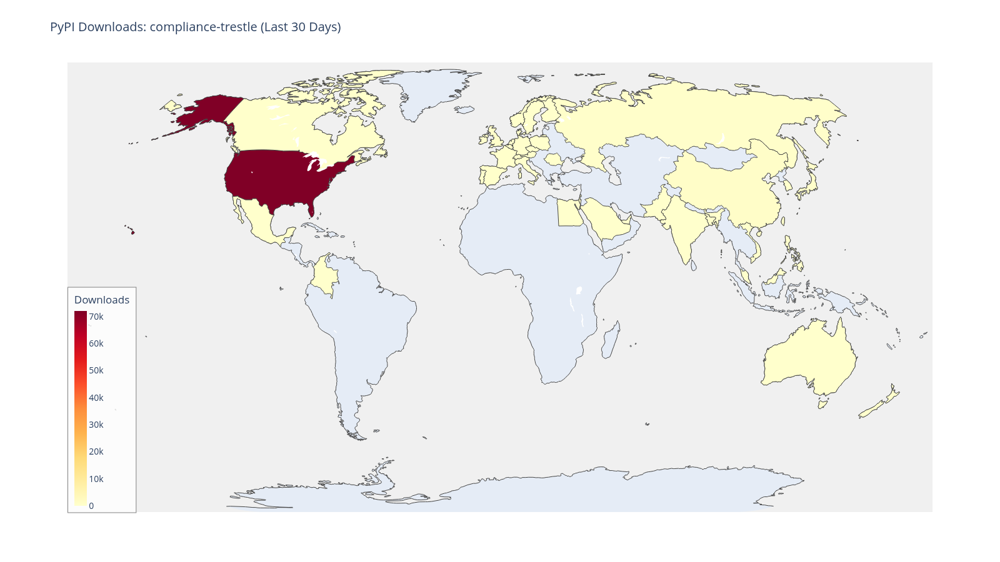

**Key Insights:**
- **Strong US dominance** (92.3%) aligns with OSCAL's US government origins
- **Asia-Pacific presence** (Singapore, China, Japan, Taiwan) shows international adoption
- **European adoption** across UK, Germany, France, Spain
- **48 countries total** demonstrates global reach for security/compliance tooling

### 90-Day Analysis

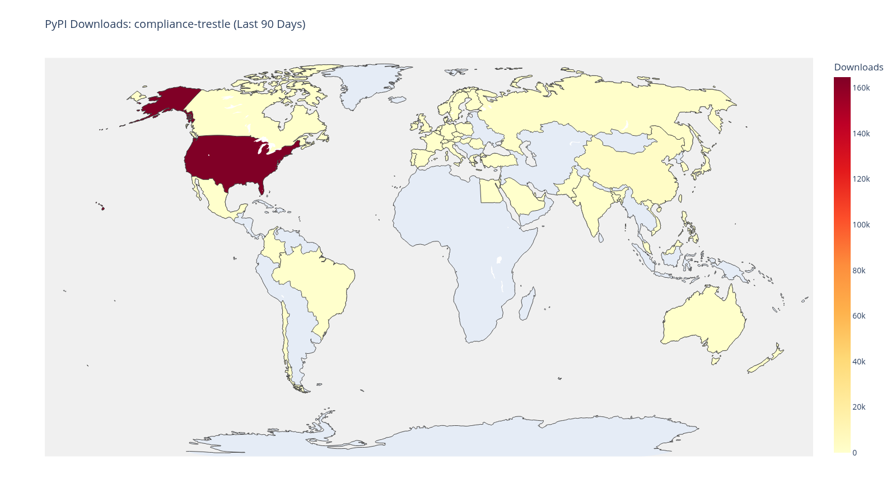

**90-Day Trends:**
- **65 countries reached** (up from 48 in 30 days)
- **Consistent US dominance** across time periods
- **Growing international adoption** in Asia and Europe
- **Emerging markets** in Middle East and Africa

---

## 🤖 MCP (Model Context Protocol) Usage Analysis

### What is MCP?

MCP (Model Context Protocol) is Anthropic's protocol for connecting AI assistants like Claude to external tools and data sources. When developers use Claude Desktop with MCP servers, they often install Python packages via `uvx` (uv's tool runner).

### Detection Methodology

Since MCP servers don't explicitly identify themselves in PyPI logs, we use **proxy signals** with significant limitations:

1. **HIGH Confidence:** `uvx` subcommand usage (MCP's recommended pattern, but also used for other tools)
2. **Contextual:** UV vs pip adoption trends (UV is MCP's recommended installer)
3. **Observational:** CI vs non-CI patterns (shows usage context, not MCP specifically)

**Important Limitations:**
- PyPI data shows **installs, not actual usage** - packages may be installed but never run
- `uvx` is used for many tools beyond MCP servers
- Non-CI downloads don't isolate MCP - most PyPI downloads are non-CI regardless
- The `details.ci` field is heuristically derived and unreliable
- Cannot distinguish MCP from other UV usage without raw user-agent strings

### MCP Analysis Charts

**Interactive Dashboards:** [30-Day](reports/mcp_inference_30day.html) | [90-Day](reports/mcp_inference_90day.html)

#### 1. Installer Utilized
*Shows which installer tool was used to download the package (pip, uv, or poetry). UV (red) is a proxy for MCP since MCP clients use UV.*

<table><tr>
<td width="50%">

**30 Days**

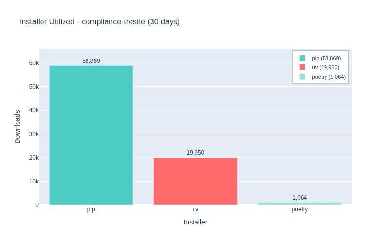
UV: 20.6% of downloads (16,055)


</td>
<td width="50%">

**90 Days**

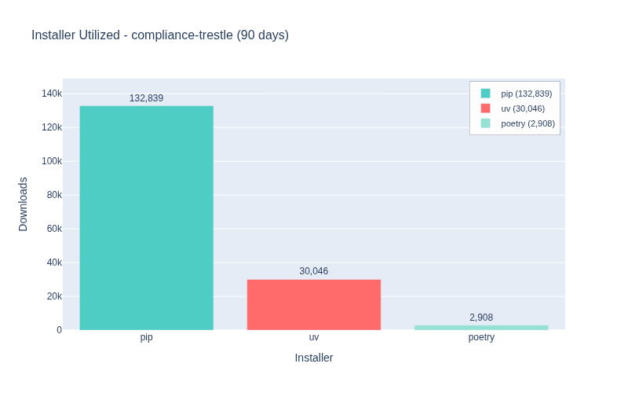
UV: 19.8% of downloads (46,485)


</td>
</tr></table>

#### 2. UV Subcommands (uvx = MCP Pattern)
*Breaks down all 16,055 UV downloads by which UV subcommand was used. The `uvx` command (red) is the standard pattern MCP clients use to run MCP servers (e.g., Claude Desktop, Cline, etc.).*

<table><tr>
<td width="50%">

**30 Days**

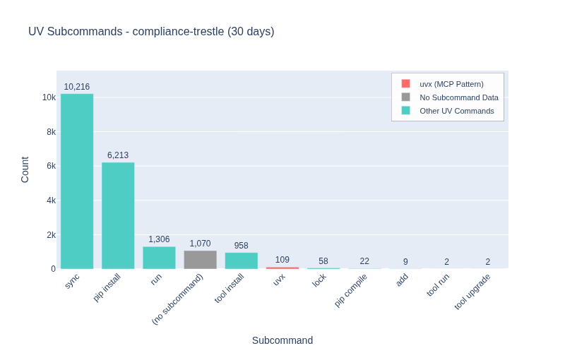

**101 uvx downloads** = HIGH confidence MCP

</td>
<td width="50%">

**90 Days**

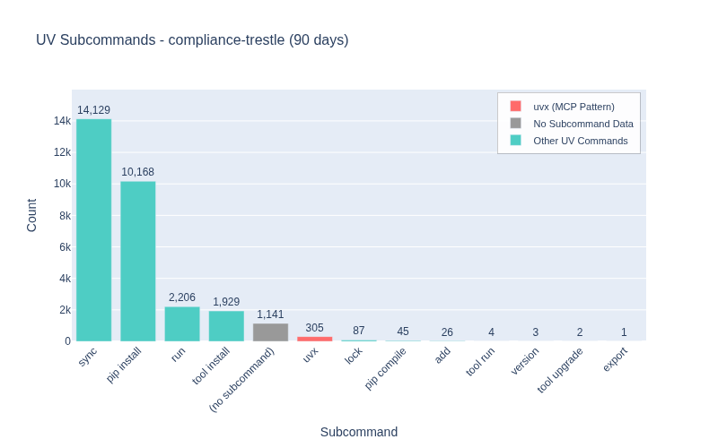

**303 uvx downloads** = 3.0x growth

</td>
</tr></table>

**UV Subcommand Meanings:**
- **`sync`** - Synchronize project dependencies → *CI/CD pipelines, developers syncing environments*
- **`pip install`** - UV's pip-compatible install command → *CI/CD, automated builds, legacy workflows*
- **`(no subcommand)`** - UV downloads without subcommand data (gray bar) → *Older UV versions or incomplete logging*
- **`run`** - Run a script in a virtual environment → *Developers, test runners, automation scripts*
- **`tool install`** - Install a tool globally → *Developers setting up their environment*
- **`uvx`** - Run a tool without installing it → ***MCP clients (Claude Desktop, Cline), developers trying tools***
- **`lock`** - Generate a lockfile for dependencies → *Developers, CI/CD for reproducible builds*
- **`pip compile`** - Compile requirements files → *CI/CD, dependency management workflows*
- **`add`** - Add a dependency to the project → *Developers adding new packages*
- **`tool run`** - Run an installed tool → *Developers, automation scripts*
- **`tool upgrade`** - Upgrade an installed tool → *Developers maintaining tools*

#### 3. CI vs Non-CI Usage
*Separates automated CI/CD installs (green) from other downloads (red). Shows that 45.9% of UV downloads are non-CI, compared to only 17.9% of pip downloads being non-CI, which may suggest different usage patterns.*

<table><tr>
<td width="50%">

**30 Days**

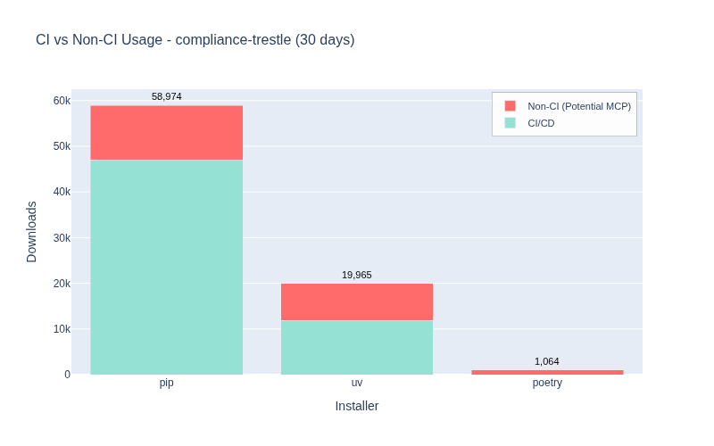

UV: 45.9% non-CI (7,366 downloads)

</td>
<td width="50%">

**90 Days**

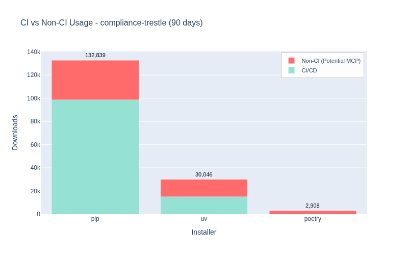

UV: 46.7% non-CI (21,699 downloads)

</td>
</tr></table>

#### 4. Daily UV Trend
*Red area = confirmed `uvx` (MCP pattern), teal line = total UV usage.*

<table><tr>
<td width="50%">

**30 Days**

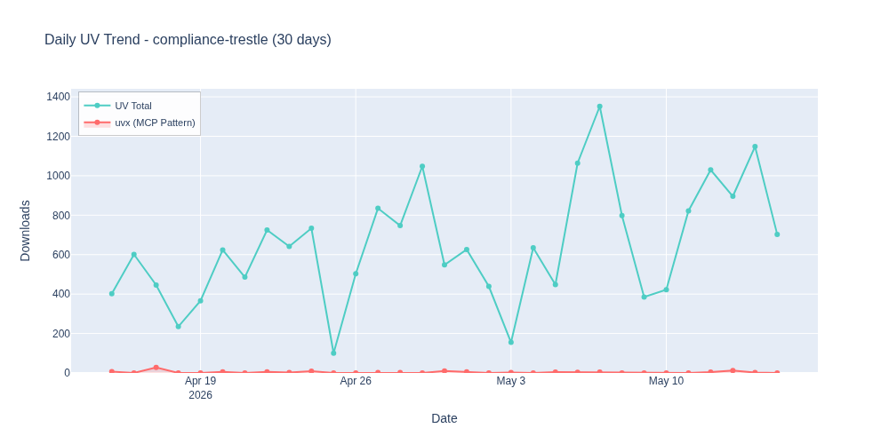

Sporadic uvx usage, emerging adoption

</td>
<td width="50%">

**90 Days**

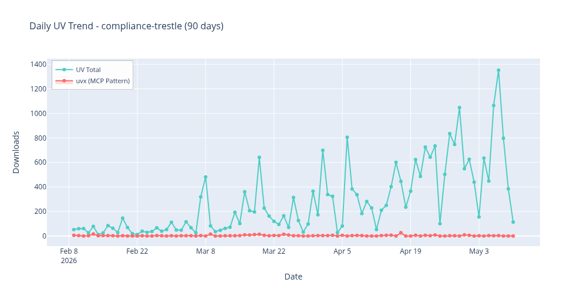

Increasing uvx frequency, growing trend

</td>
</tr></table>


---

### Key Findings Summary

| Metric | 30 Days | 90 Days | Growth |
|--------|---------|---------|--------|
| **Confirmed MCP (uvx)** | 101 | 303 | 3.0x |
| **UV Total** | 16,055 | 46,485 | 2.9x |
| **UV Market Share** | 20.6% | 19.8% | Stable |

**Key Insights:**
- **MCP usage growing linearly** with overall package adoption
- **UV adoption stable** around 20%, indicating sustained usage
- **uvx pattern consistent** at ~0.6-0.7% of UV usage
- **Early adoption phase** - MCP is real but still emerging

### MCP Inference Limitations

**What we CAN detect:**
- ✅ Explicit `uvx` subcommand usage (MCP pattern)
- ✅ UV vs pip adoption trends
- ✅ CI/CD vs interactive usage patterns
- ✅ Geographic and temporal patterns

**What we CANNOT detect:**
- ❌ Raw HTTP user-agent strings (not stored by PyPI)
- ❌ Specific MCP server packages being installed
- ❌ Runtime usage (only install events captured)
- ❌ Definitive separation of MCP from other UV usage

**Why:** PyPI's BigQuery dataset parses user-agent strings into structured fields (`installer.name`, `installer.version`, `installer.subcommand`) but doesn't store the raw string that might contain "Claude" or "MCP".

**For detailed methodology:** See [mcp_inference_explanation_30day.md](reports/mcp_inference_explanation_30day.md)

---

## 🚀 Deployment Environment Analysis

### Interactive Deployment Charts

Analyze deployment environments beyond country-level data using `details.distro`, CPU architecture, and libc metadata.

**To generate charts, run:**
```bash
make viz-deploy
```

This creates 8 interactive visualizations in `reports/` (both HTML and PNG):

#### 1. Platform Distribution
*Pie chart showing AWS (Amazon Linux), Containers (Alpine), Enterprise (RHEL), Ubuntu, Debian, macOS, Windows distribution*

<table><tr>
<td width="50%">

**30 Days**

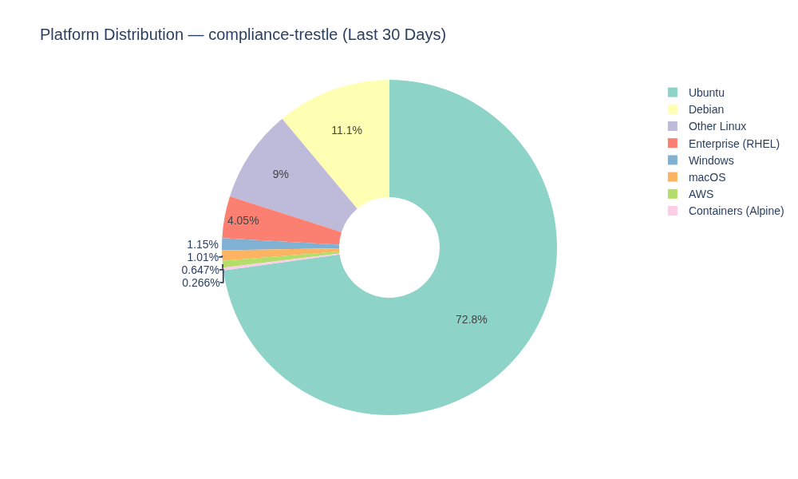

</td>
<td width="50%">

**90 Days**

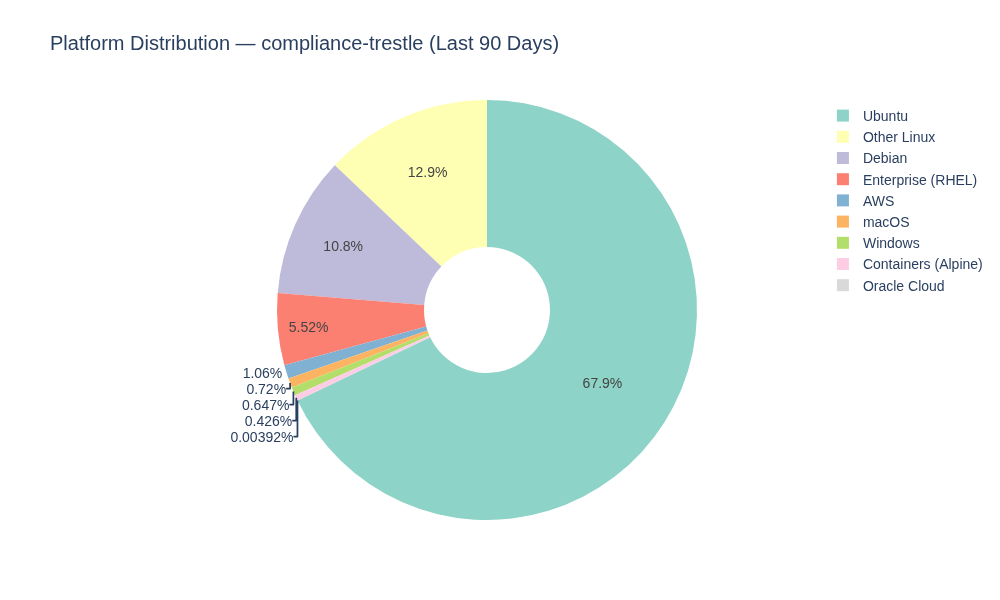

</td>
</tr></table>

#### 2. Deployment Types
*Horizontal bar chart breaking down: Containers (musl/Alpine), AWS CI/CD, AWS VMs, Enterprise VMs, CI Pipelines, Developer Macs, Windows*

<table><tr>
<td width="50%">

**30 Days**

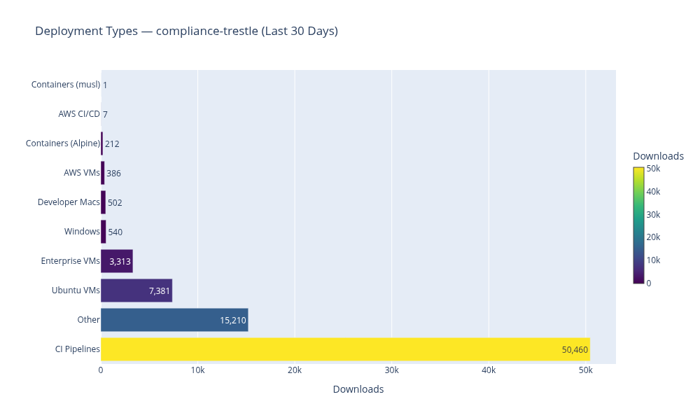

</td>
<td width="50%">

**90 Days**

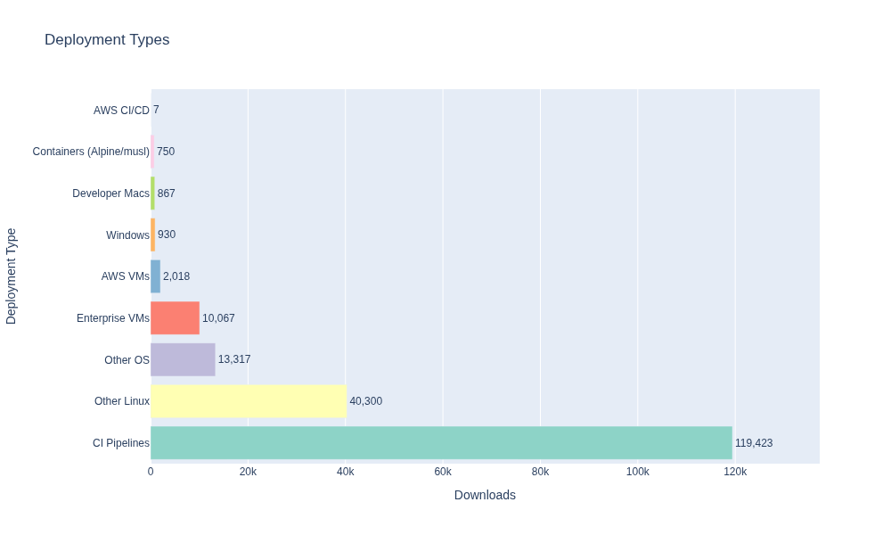

</td>
</tr></table>

#### 3. Architecture Distribution
*Stacked bar chart showing CPU architectures (x86_64 vs ARM/Graviton) by platform - reveals ARM adoption trends*

<table><tr>
<td width="50%">

**30 Days**

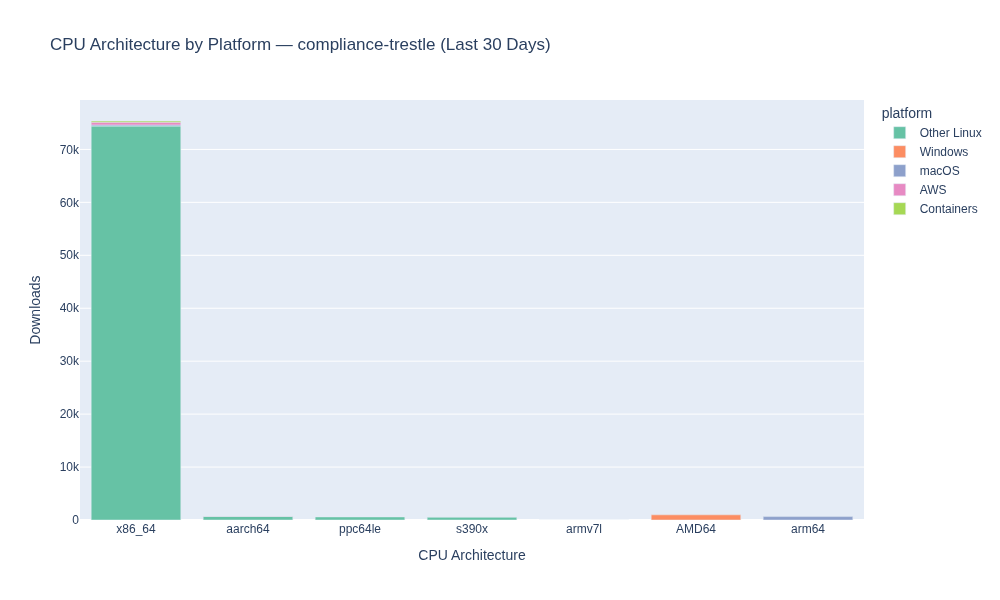

</td>
<td width="50%">

**90 Days**

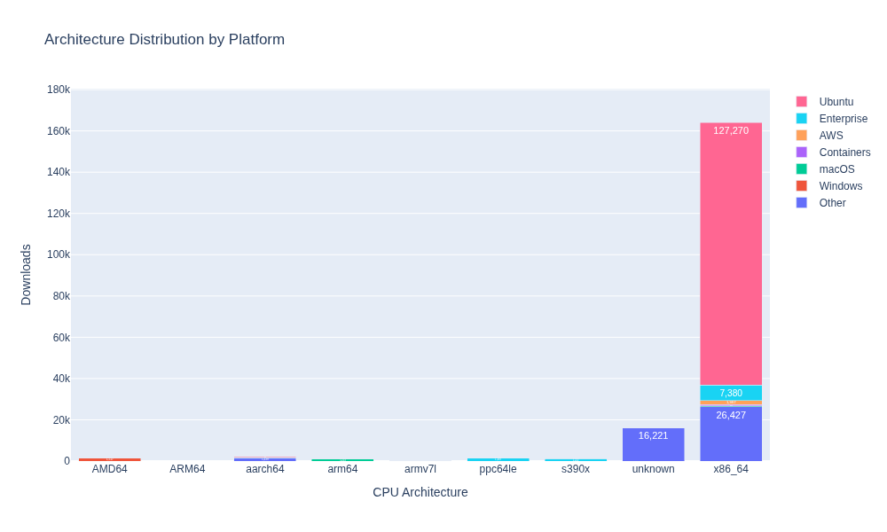

</td>
</tr></table>

#### 4. Geographic Deployment
*Stacked bar chart of top 15 countries by deployment type - shows regional preferences (US developers vs EU enterprise)*

<table><tr>
<td width="50%">

**30 Days**

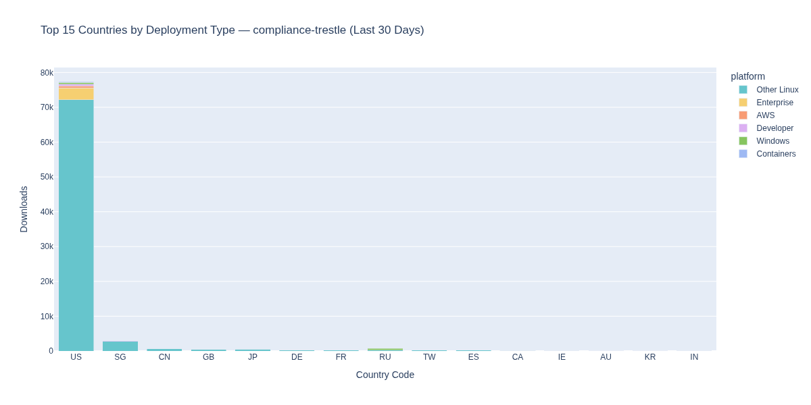

</td>
<td width="50%">

**90 Days**

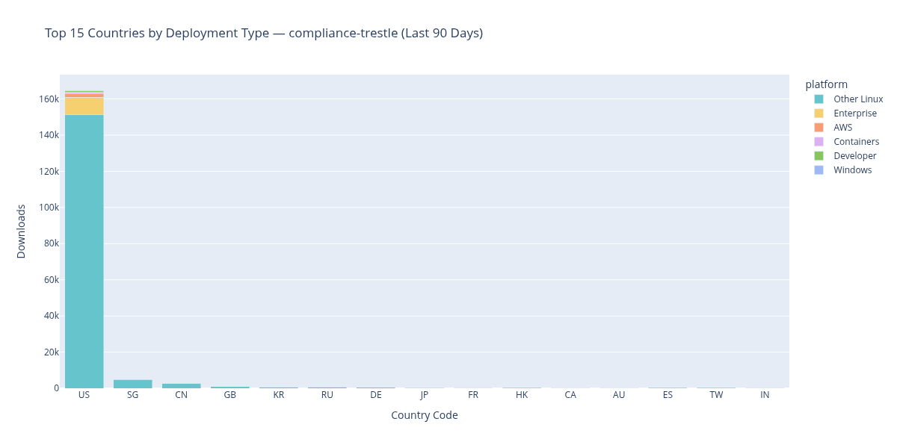

</td>
</tr></table>

#### 5. Enterprise vs Cloud-Native
*Sunburst chart with hierarchical view: Enterprise (RHEL/Oracle/SUSE), Cloud-Native (Alpine/AWS CI/Ubuntu CI), Developer (macOS), Corporate (Windows) - each split by CI/CD vs Interactive*

<table><tr>
<td width="50%">

**30 Days**

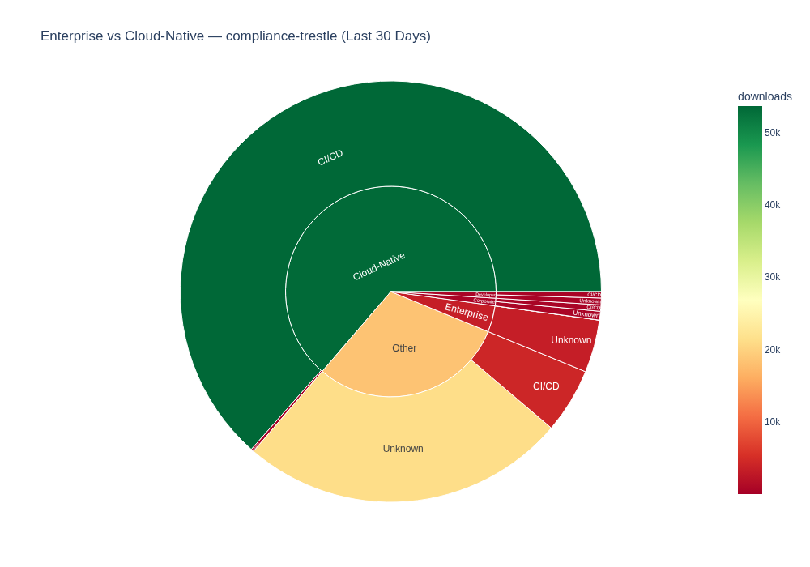

</td>
<td width="50%">

**90 Days**

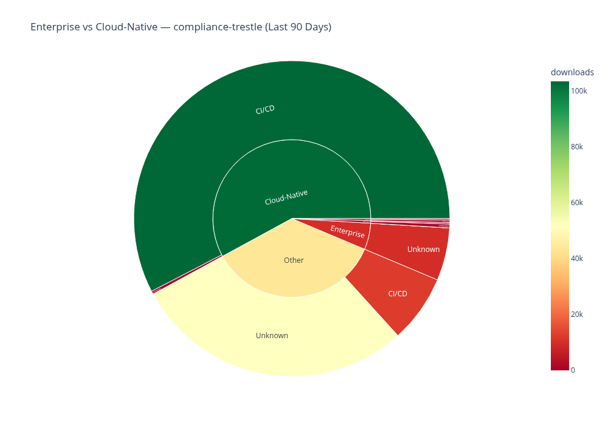

</td>
</tr></table>

#### 6. libc Distribution
*Treemap showing glibc vs musl distribution (musl = containerized deployments) broken down by distro*

<table><tr>
<td width="50%">

**30 Days**


</td>
<td width="50%">

**90 Days**

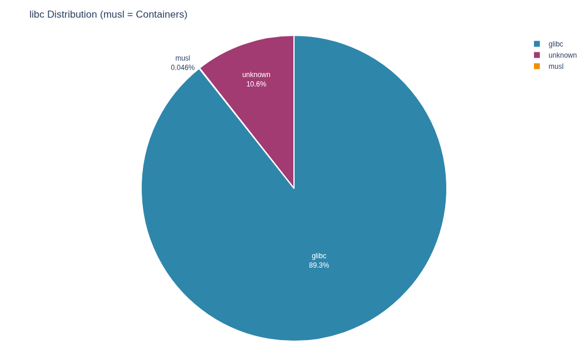

</td>
</tr></table>

#### 7. Compliance Use Cases
*Donut chart specific to compliance-trestle: C2P Pipeline (Alpine+CI), AWS Automation (Amazon Linux+CI), Gov/DoD Compliance (RHEL), CI Compliance (Ubuntu+CI), Development (macOS), SDK Usage (Windows)*

<table><tr>
<td width="50%">

**30 Days**

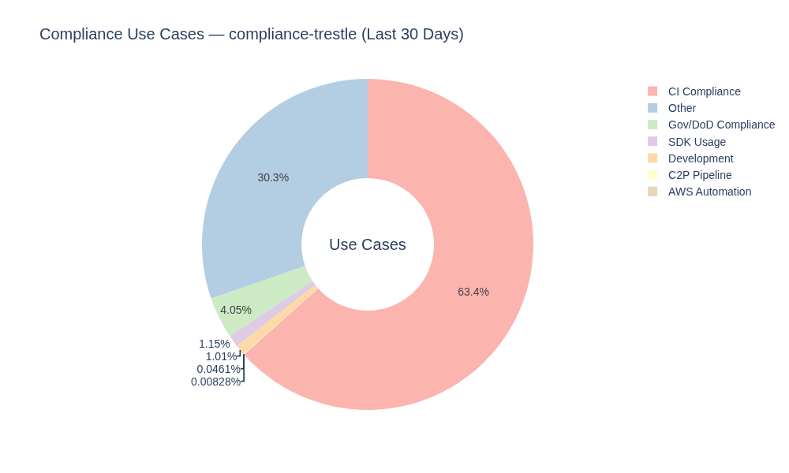

</td>
<td width="50%">

**90 Days**

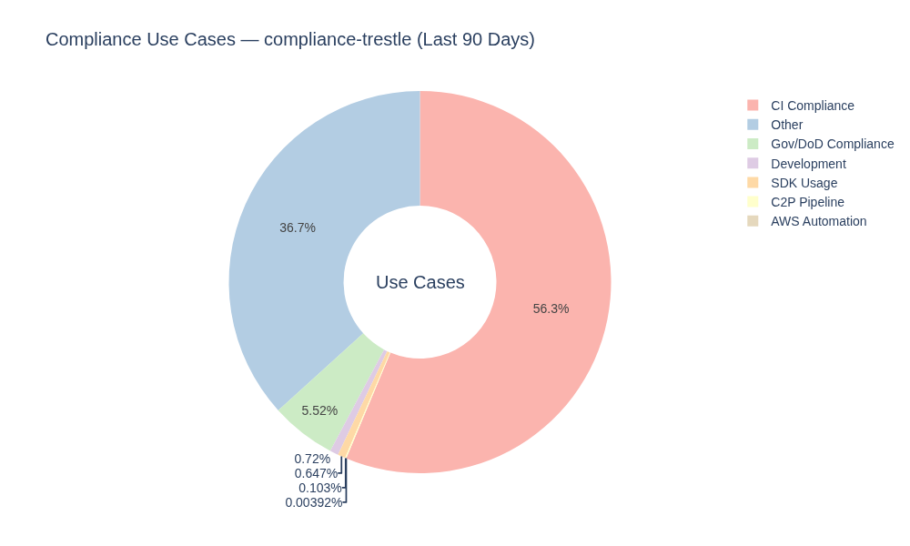

</td>
</tr></table>

#### 8. Summary Dashboard
*Horizontal bar chart showing key deployment metrics with percentages: Container adoption (Alpine), AWS usage, Enterprise deployment (RHEL), CI/CD pipelines, ARM architecture adoption, musl libc usage (containers)*

<table><tr>
<td width="50%">

**30 Days**

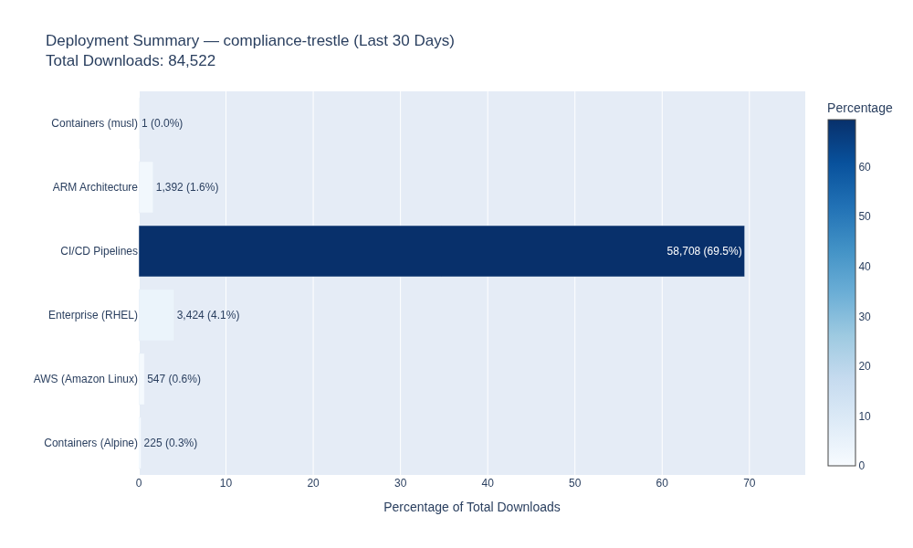

</td>
<td width="50%">

**90 Days**

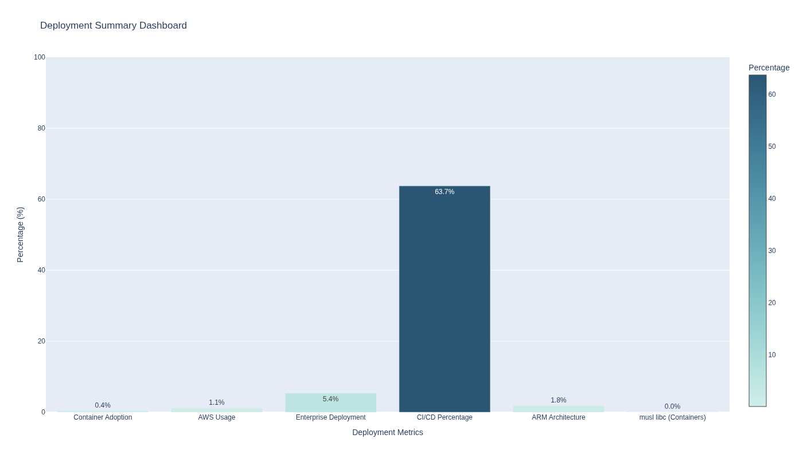

</td>
</tr></table>

### Key Deployment Insights

**What We Can Detect:**
- ✅ **Cloud Providers** - AWS (Amazon Linux), GCP (Debian), Oracle Cloud via distro signatures
- ✅ **Containers** - Alpine Linux and musl libc indicate Docker/Kubernetes deployments
- ✅ **ARM Adoption** - AWS Graviton (aarch64 + Amazon Linux) and Apple Silicon (arm64 + macOS)
- ✅ **Enterprise** - RHEL indicates Government/DoD, Oracle/SUSE for enterprise
- ✅ **C2P Pipelines** - Alpine + CI = Kyverno policy generation in Kubernetes

**Generate Charts:**
```bash
make viz-deploy-30  # 30-day analysis
make viz-deploy-90  # 90-day analysis
```

For detailed methodology, see **[DEPLOYMENT_ANALYSIS.md](DEPLOYMENT_ANALYSIS.md)**

---

## 💻 Platform & Technology Analysis

### Operating Systems

| OS/Distribution | 30 Days | % | 90 Days | % |
|-----------------|---------|---|---------|---|

**Key Insights:**
- **98.5% Linux adoption** - Strong enterprise and DevOps focus
- **Ubuntu dominates** with ~74% across both periods
- **RHEL presence** (4.2%) indicates enterprise adoption
- **Docker usage** evident from Alpine Linux

### Python Versions

| Python Version | 30 Days | % | 90 Days | % |
|----------------|---------|---|---------|---|

**Key Insights:**
- **Modern Python dominance** - ~91% on Python 3.11+ across both periods
- **Early adopters** - 7.9% testing Python 3.14 dev builds
- **Active maintenance** - Users keeping Python versions current

### Package Installers

| Installer | 30 Days | % | 90 Days | % |
|-----------|---------|---|---------|---|

**Key Insights:**
- **pip remains dominant** at ~73% across both periods
- **uv growing** at ~20% - modern, fast installer
- **Consistent patterns** - Similar distribution across time periods
- **poetry usage** stable at 1.4%

---

## 📈 Adoption Signals

### Enterprise Indicators
- ✅ **RHEL presence** (4.2%) - Enterprise Linux environments
- ✅ **CI/CD dominance** (71%) - Automated deployment pipelines
- ✅ **Ubuntu/Debian** (84%) - Cloud and container deployments
- ✅ **Geographic diversity** (48 countries) - Global enterprise adoption

### Developer Ecosystem
- ✅ **Modern Python** (91.7% on 3.11+) - Active maintenance
- ✅ **Fast adopters** - 20.6% using uv installer
- ✅ **Quick updates** - 62.9% on latest 4.0.x versions
- ✅ **MCP integration** - 101 confirmed MCP-pattern downloads

### AI Tool Integration
- ✅ **MCP adoption detected** - 101 uvx downloads (0.13%)
- ✅ **Growing trend** - 3.0x growth over 90 days
- ✅ **Interactive usage** - UV's 45.9% non-CI ratio
- ⚠️ **Early phase** - Still <1% of total downloads

---

## Automated Updates (CI/CD)

The repository includes a GitHub Actions workflow that automatically updates analytics on a configurable schedule:

- **Default schedule:** Weekly on Mondays at 2 AM ET (6 AM UTC)
- **Manual trigger:** Available via GitHub Actions UI
- **Setup guide:** See [CI_CD_SETUP.md](CI_CD_SETUP.md)

**Quick setup:**
1. Configure GitHub secrets (`GCP_CREDENTIALS`, `GCP_PROJECT_ID`)
2. Enable the workflow (enabled by default)
3. Monitor runs in the Actions tab

[](https://github.com/YOUR_USERNAME/YOUR_REPO/actions/workflows/update-analytics.yml)

---

## 🔍 Data Sources & Methodology

**Data Source:** Google BigQuery public dataset `bigquery-public-data.pypi.file_downloads`

**Analysis Period:**
- 30-day reports: April 10 - May 10, 2026
- 90-day reports: February 9 - May 10, 2026

**Update Frequency:**
- **Automated:** CI/CD pipeline runs on a configurable schedule (see [workflow configuration](.github/workflows/update-analytics.yml#L4-L6)), automatically fetching latest data and updating this repository
- **Manual trigger:** Available via GitHub Actions UI for on-demand updates
- **Local generation:** Run `make reports` to generate reports locally (does not update repository)
- **Setup & customization:** See [CI_CD_SETUP.md](CI_CD_SETUP.md) for configuration details

**Privacy:** All data comes from PyPI's public dataset. No personal information is collected or stored.

---

*Analytics for the [compliance-trestle](https://github.com/oscal-compass/compliance-trestle) project*