# PyPI Download Analytics for compliance-trestle

**Recent insights into PyPI package adoption and usage patterns**

This repository contains automated BigQuery analytics and reports for PyPI packages.

**Report Date:** 2026-05-19

---

## 📊 Version Adoption Trends

*Quarterly download trends by major version over the last 3 years. Shows version adoption patterns and migration trends across releases.*

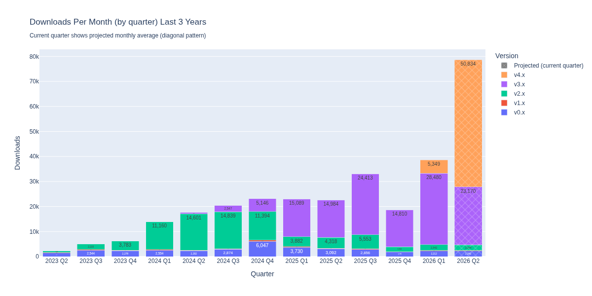

---

## 🔑 Key Metrics Summary
<!-- METRICS_TABLE_START -->
| Metric | 30 Days | 90 Days |
|--------|---------|---------|
| **Total Downloads** | 85,961 | 187,679 |
| **Countries Reached** | 51 | 66 |
| **CI/CD Installs** | 69.9% | 63.7% |
| **UV Adoption** | 25.9% | 18.0% |
| **Confirmed MCP Usage** | 96 | 315 |
<!-- METRICS_TABLE_END -->

---

## 🌍 Geographic Distribution

<table>
<tr>
<td width="50%" align="center">

### 30-Day Analysis

</td>
<td width="50%" align="center">

### 90-Day Analysis

</td>
</tr>
<tr>
<td width="50%" align="center">

</td>
<td width="50%" align="center">

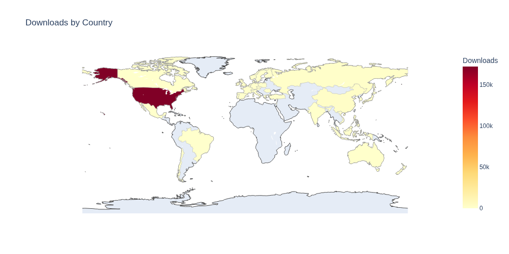

</td>
</tr>
<tr>
<td width="50%" valign="top">

**Top 10 Countries:**
<!-- COUNTRIES_30_START -->
| Country | Downloads | % |
|---------|-----------|---|
|  United States | 78,353 | 91.1% |
|  Singapore | 3,016 | 3.5% |
|  Russian Federation | 888 | 1.0% |
|  China | 788 | 0.9% |
|  Japan | 618 | 0.7% |
|  United Kingdom | 457 | 0.5% |
|  Germany | 270 | 0.3% |
|  United Arab Emirates | 248 | 0.3% |
|  Taiwan, Province of China | 200 | 0.2% |
|  Spain | 195 | 0.2% |
<!-- COUNTRIES_30_END -->

</td>
<td width="50%" valign="top">

**Top 10 Countries:**
<!-- COUNTRIES_90_START -->
| Country | Downloads | % |
|---------|-----------|---|
|  United States | 171,859 | 91.6% |
|  Singapore | 5,668 | 3.0% |
|  China | 2,252 | 1.2% |
|  United Kingdom | 1,383 | 0.7% |
|  Russian Federation | 1,260 | 0.7% |
|  Japan | 703 | 0.4% |
|  Korea, Republic of | 595 | 0.3% |
|  Germany | 593 | 0.3% |
|  India | 380 | 0.2% |
|  France | 368 | 0.2% |
<!-- COUNTRIES_90_END -->

</td>
</tr>
</table>

<!-- GEO_INSIGHTS_START -->
**Key Insights:**
- ** United States dominance** (91.1% in 30d, 91.6% in 90d) consistent across periods
- **51 countries (30d), 66 countries (90d)** demonstrates global reach
<!-- GEO_INSIGHTS_END -->

---

## 🤖 MCP (Model Context Protocol) Usage Analysis

### What is MCP?

MCP (Model Context Protocol) is Anthropic's protocol for connecting AI assistants like Claude to external tools and data sources. When developers use Claude Desktop with MCP servers, they often install Python packages via `uvx` (uv's tool runner).

### Detection Methodology

Since MCP servers don't explicitly identify themselves in PyPI logs, we use **proxy signals** with significant limitations:

1. **HIGH Confidence:** `uvx` subcommand usage (MCP's recommended pattern, but also used for other tools)
2. **Contextual:** UV vs pip adoption trends (UV is MCP's recommended installer)
3. **Observational:** CI vs non-CI patterns (shows usage context, not MCP specifically)

**Important Limitations:**
- **Install vs Usage:** PyPI data shows package downloads, not actual execution - packages may be installed but never run
- **uvx Ambiguity:** The `uvx` command is used for many tools beyond MCP servers (any Python CLI tool can be run via uvx)
- **Non-CI Context:** Non-CI downloads don't isolate MCP usage - most PyPI downloads are non-CI regardless of use case
- **CI Detection Issues:** The `details.ci` field in BigQuery is heuristically derived from user-agent strings (checking for patterns like "github", "travis", "jenkins") and is unreliable - many CI systems don't identify themselves, and some non-CI tools may match the patterns
- **User-Agent Limitations:** Cannot distinguish MCP from other UV usage without access to raw user-agent strings, which are not available in the public BigQuery dataset
- **Proxy Signals Only:** All MCP detection relies on indirect signals (installer choice, subcommand usage) rather than explicit MCP identification

### MCP Analysis Charts

#### 1. Installer Utilized
*Shows which installer tool was used to download the package (pip, uv, or poetry). UV is a proxy for MCP since MCP clients use UV.*

<table><tr>
<td width="50%">

**30 Days**

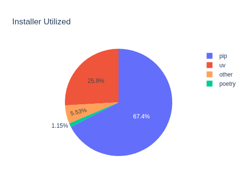

<!-- UV_INSTALLER_30_START -->
UV: 25.9% of downloads (22,263)
<!-- UV_INSTALLER_30_END -->

</td>
<td width="50%">

**90 Days**

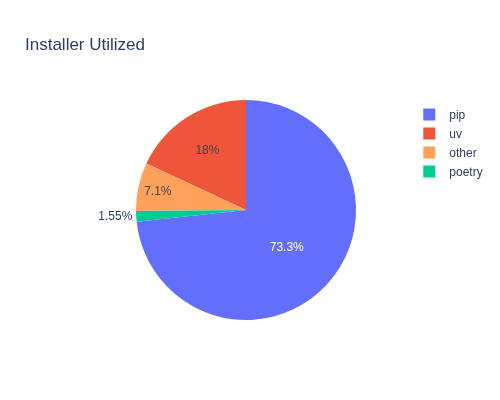

<!-- UV_INSTALLER_90_START -->
UV: 18.0% of downloads (33,858)
<!-- UV_INSTALLER_90_END -->

</td>
</tr></table>

#### 2. UV Subcommands (uvx = MCP Pattern)
*Breaks down all UV downloads by which UV subcommand was used. The `uvx` command is the standard pattern MCP clients use to run MCP servers (e.g., Claude Desktop, Cline, etc.).*

<table><tr>
<td width="50%">

**30 Days**

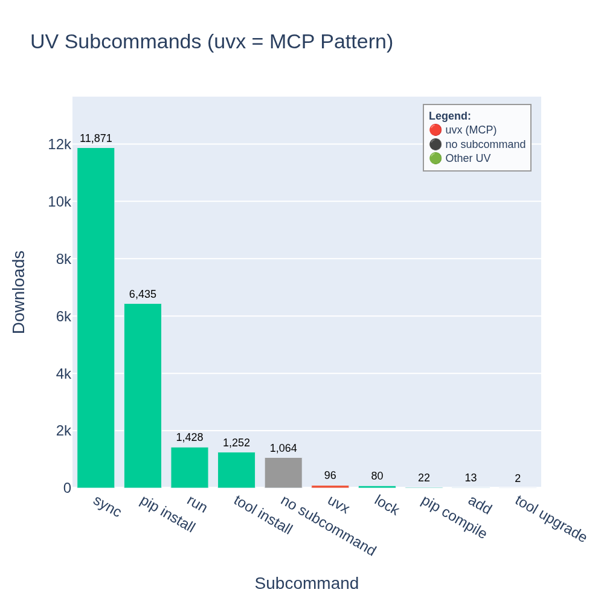

<!-- UVX_30_START -->
**96 uvx downloads** = HIGH confidence MCP
<!-- UVX_30_END -->

</td>
<td width="50%">

**90 Days**

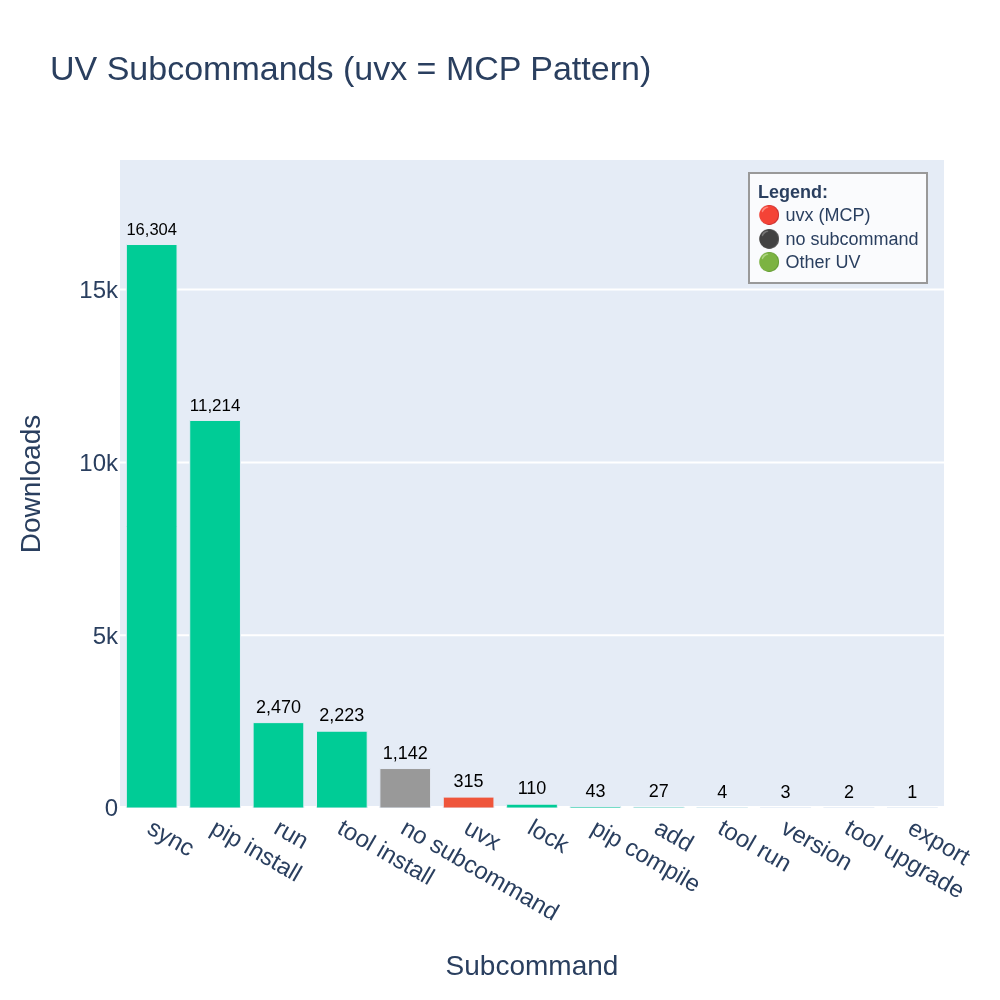

<!-- UVX_90_START -->
**315 uvx downloads** = HIGH confidence MCP
<!-- UVX_90_END -->

</td>
</tr></table>

**UV Subcommand Meanings:**
- **`sync`** - Synchronize project dependencies → *CI/CD pipelines, developers syncing environments*
- **`pip install`** - UV's pip-compatible install command → *CI/CD, automated builds, legacy workflows*
- **no subcommand** - UV downloads without subcommand data → *Older UV versions or incomplete logging*
- **`run`** - Run a script in a virtual environment → *Developers, test runners, automation scripts*
- **`tool install`** - Install a tool globally → *Developers setting up their environment*
- **`uvx`** - Run a tool without installing it → ***MCP clients (Claude Desktop, Cline), developers trying tools***
- **`lock`** - Generate a lockfile for dependencies → *Developers, CI/CD for reproducible builds*
- **`pip compile`** - Compile requirements files → *CI/CD, dependency management workflows*
- **`add`** - Add a dependency to the project → *Developers adding new packages*
- **`tool run`** - Run an installed tool → *Developers, automation scripts*
- **`tool upgrade`** - Upgrade an installed tool → *Developers maintaining tools*

#### 3. CI vs Non-CI Usage
*Separates automated CI/CD installs from other downloads for pip, uv, poetry, and other installers.*

<table><tr>
<td width="50%">

**30 Days**

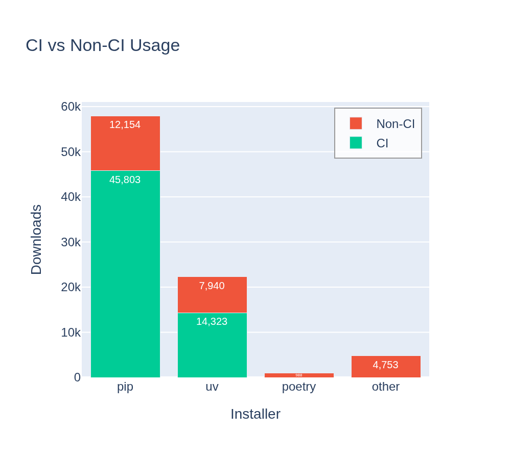

<!-- UV_NON_CI_30_START -->
UV: 35.7% non-CI (7,940 downloads)
<!-- UV_NON_CI_30_END -->

</td>
<td width="50%">

**90 Days**

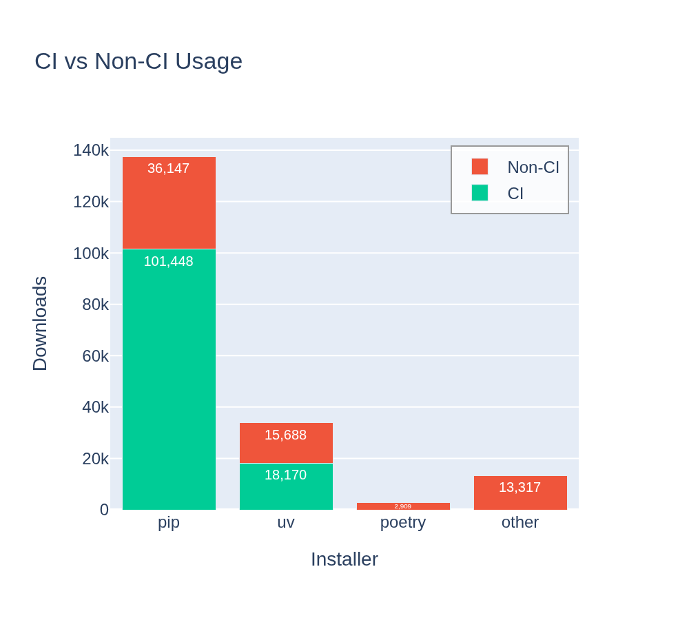

<!-- UV_NON_CI_90_START -->
UV: 46.3% non-CI (15,688 downloads)
<!-- UV_NON_CI_90_END -->

</td>
</tr></table>

#### 4. Daily UV Trend
*Time series showing daily UV download trends. Highlights confirmed `uvx` subcommand usage (MCP pattern) alongside total UV downloads to visualize MCP adoption patterns over time.*

<table><tr>
<td width="50%">

**30 Days**

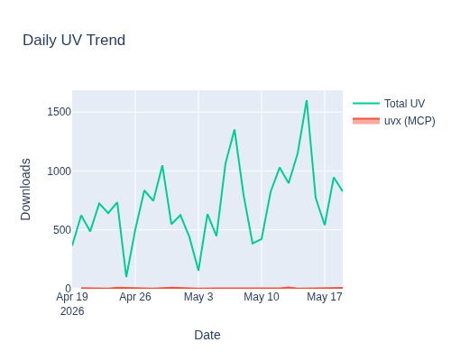

<!-- DAILY_TREND_30_START -->
96 uvx downloads over 30 days
<!-- DAILY_TREND_30_END -->

</td>
<td width="50%">

**90 Days**

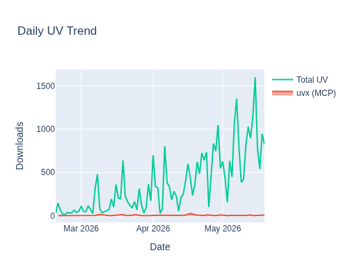

<!-- DAILY_TREND_90_START -->
315 uvx downloads over 90 days
<!-- DAILY_TREND_90_END -->

</td>
</tr></table>

**Key Findings:**

<table><tr>
<td width="50%" valign="top">

**30-Day Analysis:**
<!-- MCP_FINDINGS_30_START -->
1. **Confirmed MCP Usage:** 96 downloads using `uvx` subcommand
2. **UV Adoption:** 25.9% of downloads
3. **Interactive Usage:** 35.7% of UV downloads are non-CI

MCP usage is detectable but small. The broader story is UV's growth as a modern Python installer.
<!-- MCP_FINDINGS_30_END -->

</td>
<td width="50%" valign="top">

**90-Day Analysis:**
<!-- MCP_FINDINGS_90_START -->
1. **Confirmed MCP Usage:** 315 downloads using `uvx` subcommand
2. **UV Adoption:** 18.0% of downloads
3. **Interactive Usage:** 46.3% of UV downloads are non-CI

MCP usage is detectable but small. The broader story is UV's growth as a modern Python installer.
<!-- MCP_FINDINGS_90_END -->

</td>
</tr></table>

---

## 🚀 Deployment Environment Analysis

### Platform Distribution

*Categorizes downloads by platform based on OS and distribution detection. Identifies AWS (Amazon Linux), Containers (Alpine), Enterprise (RHEL), Ubuntu, Debian, macOS, Windows, and other platforms. Shows the overall platform mix of package users.*

<table><tr>
<td width="50%">

**30 Days**

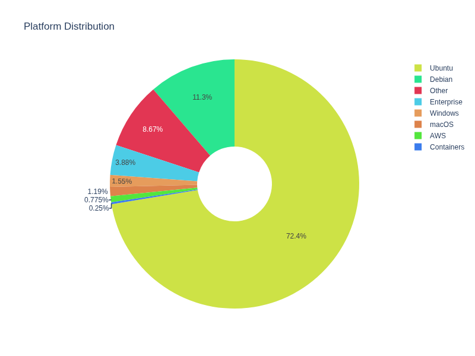

</td>
<td width="50%">

**90 Days**

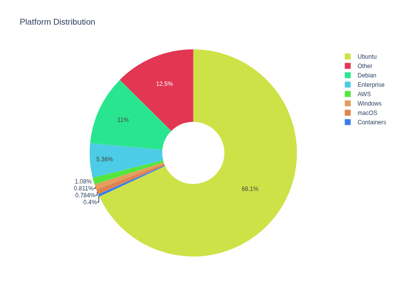

</td>
</tr></table>

### Deployment Types

*Shows the distribution of downloads across different deployment environments, automatically categorized based on OS, distribution, libc type, and CI detection. Categories may include containers, cloud VMs, CI/CD pipelines, and developer workstations.*

<table><tr>
<td width="50%">

**30 Days**

</td>
<td width="50%">

**90 Days**

</td>
</tr></table>

### Architecture Distribution

*Shows CPU architecture breakdown (x86_64, ARM64, etc.) detected from download metadata. Tracks adoption of ARM-based systems like AWS Graviton and Apple Silicon.*

<table><tr>
<td width="50%">

**30 Days**

</td>
<td width="50%">

**90 Days**

</td>
</tr></table>

### Enterprise vs Cloud-Native

*Compares traditional enterprise Linux distributions (RHEL, CentOS) against cloud-native platforms (Amazon Linux, Alpine). Indicates adoption patterns in regulated vs cloud-first environments.*

<table><tr>
<td width="50%">

**30 Days**

</td>
<td width="50%">

**90 Days**

</td>
</tr></table>

### libc Distribution (Container Signal)

*Shows the distribution of C library implementations (glibc vs musl). musl libc is a strong indicator of containerized deployments, particularly Alpine Linux in Docker/Kubernetes.*

<table><tr>
<td width="50%">

**30 Days**

</td>
<td width="50%">

**90 Days**

</td>
</tr></table>

### Deployment Context

*Categorizes downloads by deployment scenario based on OS type, Linux distribution, and CI detection. Shows patterns like containerized pipelines (Alpine+CI), cloud automation (Amazon Linux+CI), enterprise Linux (RHEL), CI environments, developer workstations (macOS/Windows), and other contexts.*

<table><tr>
<td width="50%">

**30 Days**

</td>
<td width="50%">

**90 Days**

</td>
</tr></table>

### Deployment Summary

*Key deployment metrics at a glance: container adoption, cloud provider usage, enterprise deployment, CI/CD percentage, ARM architecture adoption, and musl libc usage.*

<table><tr>
<td width="50%">

**30 Days**

</td>
<td width="50%">

**90 Days**

</td>
</tr></table>

---

---

## 🔄 Automated Updates

This repository is automatically updated weekly by GitHub Actions:
- **Schedule:** Weekly on Mondays at 6 AM UTC (2 AM ET)
- **Authentication:** Service account JSON key stored in GitHub secrets
- **Manual trigger:** Available via GitHub Actions UI
- **Setup guide:** See [SETUP.md](docs/SETUP.md)

---

## 🔍 Data Sources & Methodology

**Data Source:** Google BigQuery public dataset `bigquery-public-data.pypi.file_downloads`

**Analysis Period:**
- 30-day reports: Last 30 days from data fetch date
- 90-day reports: Last 90 days from data fetch date

**Update Frequency:**
- **Automated:** Daily via GitHub Actions
- **Caching:** Data fetched once per day, cached locally to minimize BigQuery costs
- **Cache Management:** Old cache files automatically removed after successful new fetch
- **Manual trigger:** Available for on-demand updates

**Privacy:** All data comes from PyPI's public dataset. No personal information is collected or stored.

---

*Analytics powered by Google BigQuery and GitHub Actions*